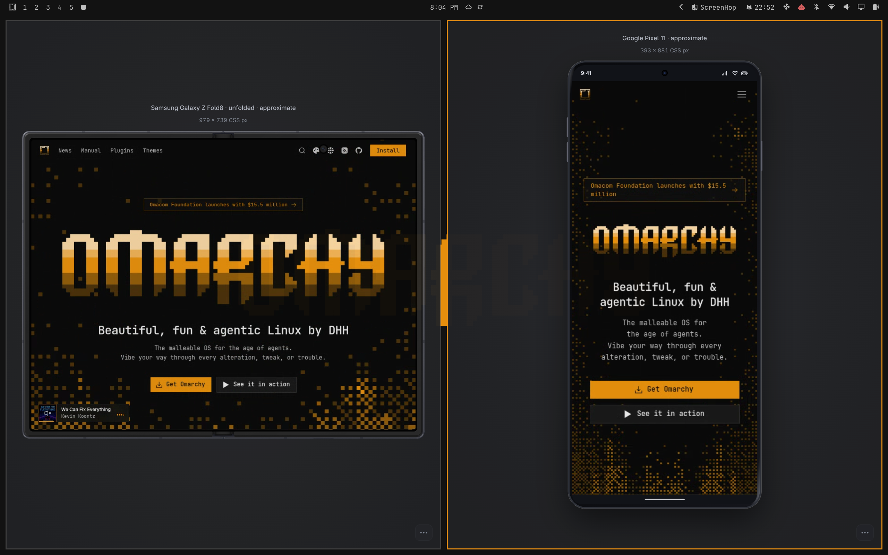

# ScreenHop

**Preview your website across multiple devices—side by side, right from Omarchy.**

Built for developers testing responsive websites. See how your site adapts across phones, tablets, foldables and desktop layouts in multiple simultaneous views. ScreenHop turns your Omarchy bar into a responsive testing workspace: choose a URL, pick your devices, and start comparing.

Link supported interactions across previews, use your phone to control a selected preview, and save screenshots or short recordings to share what you find. No browser extension, npm setup, or cloud account required.

**Version 1.0.0 · 103 presets · Custom viewports · MIT-licensed code**

- **Spot layout problems sooner.** Compare multiple device sizes in centered, borderless preview windows.
- **Repeat less, compare more.** Optionally link matching clicks, text input, scrolling and supported navigation across previews.
- **Put testing in your hand.** Pair a phone over local Wi-Fi with a QR code and drive a selected preview—or a linked group.
- **Show the issue clearly.** Export PNGs or silent recordings, with the frame included or the page on its own.
- **Return to your testing workspace.** Save sets of devices and URLs, reopen them, and capture every preview in a batch.
- **Choose how hard it works.** WebRTC previews offer Auto, Eco and Smooth modes, with JPEG fallback and live diagnostics.




Screenshots show the author's local setup with separately supplied Galaxy artwork. The public package includes ScreenHop's original decorative frames.

## Device previews

Click **ScreenHop** in the bar, enter your website URL (including localhost), and choose a device. The selected device's name and resolution appear above a centered outline. Framed previews use borderless app windows with no browser tabs, address bar, or persistent toolbar; controls appear from the small menu button on hover or keyboard focus. Phone, tablet and desktop frames surround the live webpage without covering it or changing its viewport. Large devices scale visually to fit. Framed desktop and phone previews use native WebRTC video by default. Chromium captures the device tab directly, avoiding the JPEG streaming path. Video targets 30 fps; unchanged frames can be suppressed by the encoder. The viewer automatically falls back to paced JPEG when direct capture or connection fails. These display optimizations preserve the tested CSS viewport and pixel density.

- **Device frame on:** a live offscreen Chromium renderer appears inside a centered device frame. Mouse, keyboard, paste and scrolling are forwarded to the actual page through the existing ordered local input channel. Video uses WebRTC; input currently uses authenticated HTTP, not a WebRTC data channel. Use the viewer's Frame toggle to hide the decorative outline without changing viewport dimensions.
- **Device frame off in the picker:** opens a direct Chromium window with the device and resolution in its title. This retains native browser controls and is preferable for sign-in troubleshooting or features the streamed viewer does not support.
- **Portrait/rotation:** swaps width and height before opening another preview.

Use category chips to browse Apple phones, Android phones, tablets, foldables, watches, computers, TVs, kiosks, handhelds and smart panels. **Custom size** accepts 100–3840 CSS pixels per axis and pixel density 1–4, with phone touch or desktop mode. Device skins include classic/notched/island phones, camera bezels, tablets, foldables, watches, laptops and display stands. Skins are original decorative approximations, not vendor artwork; they do not change the page viewport or emulate browser/OS chrome.

Specialty presets marked “responsive” are representative layouts, not certified device dimensions or hardware emulation. The earlier branded phone/tablet profiles use [Playwright v1.55.0 device descriptors](https://github.com/microsoft/playwright/blob/v1.55.0/packages/playwright-core/src/server/deviceDescriptorsSource.json), preferring CSS screen size when supplied. Existing preset dimensions remain compatible with earlier ScreenHop sessions.

Framed and direct previews use separate browser profiles. Within each mode, previews share that mode's browser cookies. Existing personal browser sessions are not imported. Named account profiles and session import are planned in [PLAN.md](PLAN.md).

The viewer menu shows **Live · WebRTC** when direct video is connected. Direct capture requires a secure website origin (HTTPS or localhost) and permission to capture; restrictive sites fall back automatically. Chromium may round odd encoded video dimensions down by one pixel; the source CSS viewport is unchanged. `SCREENHOP_TRANSPORT=jpeg` forces the compatibility path when starting a fresh controller.

The frame is visual styling, not a mobile operating system or Safari emulator. Chromium remains the rendering engine. Mobile pages without a viewport meta tag can have a wider layout viewport, as on actual devices. Native file pickers, downloads, browser dialogs, drag-and-drop files and accessibility tree interaction are not exposed through the streamed frame; use direct mode for those workflows.

## Screenshots and recordings

Open **⋯** and choose **Include device frame**, then **Screenshot** or **Record**. Uncheck it to save the webpage only. Screenshots download as PNG; video downloads as WebM where supported (MP4 is selected only if the browser supports it).

Page screenshots use the renderer's device pixel density—for example, a 390 × 844 viewport at 3× produces a 1170 × 2532 PNG. Frame screenshots capture the displayed skin and webpage at the viewer's display resolution. Neither export changes the webpage viewport. Device skins remain decorative approximations, not Safari or a mobile operating system.

Recording with a frame asks you to share **this ScreenHop tab** in Chromium's sharing dialog. Other tabs or screens are rejected. Page-only recording uses the existing preview video and needs no screen-sharing permission. A visible timer and **Stop** button remain outside the device's clickable area. Recordings are silent and stop at 3 minutes or 128 MB. Frame recording needs desktop Chromium; supported phone browsers can use page-only recording and both screenshot modes.

## Linked browsing and authentication

Linking **defaults off**. Enable **Link previews** for ordinary page comparison. It mirrors matching clicks, ordinary text input and proportional page scrolling. Trusted same-origin navigation from links, buttons and clickable rows is copied after it settles, including SPA route changes. Redirects without a trusted navigation gesture are not broadcast. Opening another preview preserves the group’s linking setting.

Sign-in, OAuth/OIDC callbacks, verification codes and security challenges belong to one preview. ScreenHop pauses linking on recognized authentication URLs, identity-provider hosts, credential forms, MFA fields and sign-in actions. Submit controls, passwords, files and one-time codes are not mirrored. It stays paused until you explicitly enable it after authentication pages have been left.

Regression coverage includes IdentityServer, Okta, Azure AD/Microsoft Entra ID, Auth0, Google and GitHub URL patterns; OAuth2 authorization code/PKCE, implicit/hybrid callbacks, OAuth1 callback parameters, standard login and MFA forms. These are local fixtures, **not certification against every provider or a live tenant**. Unknown custom authentication UI may require an additional detection rule. Keep linking off while signing in.

Cloudflare can still challenge or reject emulated/automated browsers. ScreenHop does not bypass those checks. Cloudflare documents that headless browsers and automation are unsupported for production challenge solving: [supported browsers](https://developers.cloudflare.com/cloudflare-challenges/reference/supported-browsers/). Direct mode removes the streamed/headless view but still uses viewport emulation and is not a guarantee of challenge compatibility.

Clicks match visible unique semantic labels and text, with generated IDs as a last resort. Dialog and menu controls resolve inside the equivalent open panel; inert, aria-hidden, missing and ambiguous controls are skipped. On omarchy.org, explicit theme selections synchronize the selected theme through the site’s own buttons, including when previews start with different themes or only one theme picker is open. Browser storage and authentication data are not copied. Embedded frames, shadow DOM and arbitrary custom controls are not synchronized. Linked actions run in each preview; use test data for actions that change application state.

## Phone remote

Open framed previews, then choose **Phone remote** in the ScreenHop picker. Scan the QR code using a phone on the same Wi-Fi, select a lead preview, and enable **Link previews** to control the group. No phone app or cloud account is needed. This uses a local browser controller; it does not integrate with the LocalSend app.

Tap to click and swipe to scroll. For typing, tap the field inside the preview, open **Keyboard**, and type using the phone keyboard helper. Authentication still pauses linking; your phone controls the selected desktop renderer without importing a phone login session.

**Stop sharing** closes the listener, disconnects phones and revokes the pairing URL. ScreenHop uses TCP port **53318**. When UFW needs a rule, enabling Phone remote invokes the system password prompt to allow only the active local subnet/interface. ScreenHop never reads or stores the password. The scoped firewall rule remains for later sessions; no service listens while sharing is off. Sharing defaults off. The pairing URL grants control over these previews: use a trusted local network, since the connection uses local HTTP. Both devices must be reachable on the same network; guest Wi-Fi isolation or a firewall may block access. `qrencode` is optional; a copyable URL is always available.

## Requirements and installation

- Omarchy shell / Quickshell with third-party widgets and current Hyprland Lua dispatchers.
- Node.js 22.4 or later with built-in WebSocket support.
- Chromium, or a Chromium-based executable selected with SCREENHOP_BROWSER.

No npm installation or browser extension is needed. The MIT-licensed ws library is bundled for event delivery.

Install from the public repository:

```sh
omarchy plugin add https://github.com/jeremielumandong/omarchy-screenhop
```

For a downloaded source package, run `bash scripts/install.sh` from its directory. The installer validates the plugin and checks dependencies before installing. It does not install system packages automatically.

The widget appears at the right of the bar. The installer keeps backups outside Omarchy’s plugin discovery directory and migrates older timestamped backup folders so they cannot override the current plugin. After updating, use **Workspace and tools → Check build → Apply update** in the picker. Confirming closes and restores framed previews after the previous controller exits. Unsaved page changes are lost, phone sharing stops, and linking starts off. Authentication/callback URLs cannot be restored. Browser profile cookies are retained. The installer restarts the shell when the picker code changes, preventing cached URL defaults and controls.

### Removal

Finish any unsaved preview work, then stop both preview modes before removing the plugin:

```sh
node ~/.config/omarchy/plugins/arkane.screenhop/viewport.mjs --close
node ~/.config/omarchy/plugins/arkane.screenhop/native-preview.mjs --close
omarchy plugin remove arkane.screenhop
```

Closing framed previews also stops phone sharing when the controller exits. To hide only the widget, use `omarchy plugin disable arkane.screenhop`; hiding the widget does not stop existing previews.

Removal preserves browser profiles, saved workspaces, screenshots and installer backups. Their paths are documented below. If you enabled a UFW rule, it remains after removal: review `sudo ufw status numbered` for the rule labeled `ScreenHop phone remote`, then remove that specific numbered rule with `sudo ufw delete <number>` if it is no longer needed. ScreenHop does not remove unrelated firewall rules.

## Local state and CLI

Framed mode uses `$XDG_CACHE_HOME/screenhop-framed` and direct mode uses `$XDG_CACHE_HOME/screenhop-native` (normally under `~/.cache`). These directories contain private browser data and local controller sockets. The frame server binds to loopback and uses an unguessable URL token. Do not share those URLs as public preview links.

```sh
node viewport.mjs --device iphone-13 --url http://localhost:3000
node viewport.mjs --device pixel-5 --url http://localhost:3000 --linked
node viewport.mjs --link off
node viewport.mjs --status
node viewport.mjs --phone on
node viewport.mjs --phone off
node viewport.mjs --device custom --width 420 --height 900 --dpr 2 --mobile --url http://localhost:3000
node native-preview.mjs --device desktop --url http://localhost:3000
node native-preview.mjs --link off
node viewport.mjs --list
```

`--state /path` selects isolated test state. `--close` closes all previews belonging to that helper/mode. Closing a framed window also closes its underlying rendering page. A local controller remains attached while windows are open and exits shortly after the browser closes.

## Tests

```sh
node --test tests/auth-policy.test.mjs tests/browser.test.mjs tests/rtc-viewer.test.mjs tests/rtc-fallback.test.mjs tests/rtc-signaling.test.mjs tests/phone-remote.test.mjs
SCREENHOP_TRANSPORT=jpeg node --test tests/viewer.test.mjs
SCREENHOP_TEST_NATIVE=1 node --test tests/browser.test.mjs
bash tests/ui-smoke.sh
bash tests/install-smoke.sh
```

Browser tests require local browser/socket access. The QML test requires a Wayland session. See [VALIDATION.md](VALIDATION.md) for results.

Repository: [jeremielumandong/omarchy-screenhop](https://github.com/jeremielumandong/omarchy-screenhop). Publication details are in [PUBLICATION.md](docs/PUBLICATION.md); the marketplace listing draft is in [MARKETPLACE_SUBMISSION.md](docs/MARKETPLACE_SUBMISSION.md).

Device presets are informed by [Playwright's descriptors](https://github.com/microsoft/playwright/blob/v1.51.1/packages/playwright-core/src/server/deviceDescriptorsSource.json). Viewport emulation uses the [Chrome DevTools Protocol](https://chromedevtools.github.io/devtools-protocol/tot/Emulation/).

Capture export checks: `node --test tests/screenshot.test.mjs` and `node tests/capture-ui-smoke.mjs`. The recording smoke test requires Chromium, ffmpeg and ffprobe; ffmpeg is only a test dependency.

## Performance and diagnostics

Preview controls include **Auto**, **Eco**, and **Smooth** capture modes. Auto requests 30 fps during interaction and 10 fps after three seconds idle; hidden previews request 2 fps. Eco requests 5 fps idle and 1 fps hidden. Smooth requests 30 fps while visible and 5 fps hidden. Input immediately requests 30 fps in all modes, and recording requests 30 fps. Actual decoded FPS depends on the browser, webpage and machine. The highest demand from connected viewers controls each source capture; device CSS dimensions and DPR do not change.

**Diagnostics** displays the selected CSS viewport/DPR, received video dimensions, WebRTC decoded FPS and dropped frames. Statistics refresh only while the panel is open and visible. These are Chromium previews, not iOS/Safari emulation. Linking status and pause reasons remain visible inside preview controls.

JPEG capture starts only for viewers needing compatibility mode and stops when its final subscriber recovers or disconnects. Slow connections retain only the latest pending image while preserving the order of control messages; excessively congested connections reconnect. Multiple capture geometry updates are coalesced while retaining Chromium's required stabilization pass.

## Workspaces and batch screenshots

Expand **Workspace and tools** in the device picker. **Save open previews** stores the URLs, devices and orientations of framed previews. Choose **Open <name>** to open that set again. Saved workspaces start unlinked. Login/callback URLs are rejected; cookies, passwords and authentication transactions are never exported. Workspace files are private under `$XDG_STATE_HOME/screenhop/workspaces.json` (normally `~/.local/state`). Names are unique; existing workspaces are never silently overwritten.

**Screenshot all** saves sequential PNG captures to a new directory under `~/Pictures/ScreenHop`. Choose **Include skin** or **Page only**. These are sequential captures, not a synchronized instant across devices. The completion message gives the output directory.

**Check build** compares the installed renderer build with the running controller. **Apply update** requires explicit confirmation before closing previews. The phone diagnostics report connected preview viewers, not unique physical phones; choose **Refresh phone status** to update the count.

Additional checks:

```sh
node --test tests/workspaces.test.mjs tests/transport-performance.test.mjs tests/adaptive-capture.test.mjs
node --test tests/workspace-browser.test.mjs tests/adaptive-viewer.test.mjs
node tests/performance-bench.mjs /path/to/screenhop /tmp/screenhop-benchmark.json
```

## Mouse and touch input

Phone and tablet presets show a round touch indicator and send native single-finger touch events. Tap activates controls; drag scrolls the page. Hover-only menus are intentionally not activated on touch presets. Laptop and desktop presets use mouse input and support CSS hover; leaving a preview clears its hover state. Desktop headless capture preserves fine-pointer/hover media capabilities instead of resetting them through a disabled touch override.

## Device catalog and licensing

The 103 presets include current iPhone, Galaxy, Pixel and other Android families. See [specifications and CSS viewport assumptions](docs/DEVICE_SOURCES.md). New CSS sizes are visibly marked approximate: panel pixels divided by a selected DPR do not establish a hardware-verified browser viewport.

The public package uses ScreenHop's original decorative frames. Samsung-provided emulator PNG artwork is excluded; local development installations may contain separately supplied artwork. Manufacturer names identify test presets and do not imply endorsement.

ScreenHop code and its original preview artwork are MIT licensed. Adapted Playwright device descriptors retain Apache-2.0 licensing and notices; see [third-party notices](THIRD_PARTY_NOTICES.md). The preview screenshots were supplied by the author and show ScreenHop displaying omarchy.org, including the author’s local Galaxy skin setup.

### Multiple preview connections

Preview events and video signaling responses use authenticated WebSockets, avoiding the HTTP connection-pool exhaustion that previously stalled the sixth preview. WebRTC still carries video; validated HTTP endpoints still carry input and control requests. Seven desktop previews plus seven phone viewers are covered by an isolated small-viewport regression; actual device count and performance depend on website complexity and hardware.

For a Git-managed install, use `omarchy plugin update arkane.screenhop` to fetch updates, then **Workspace and tools → Check build → Apply update** to reopen existing previews with the new controller. Finish unsaved work before applying. Copied local installs must rerun their installer.
